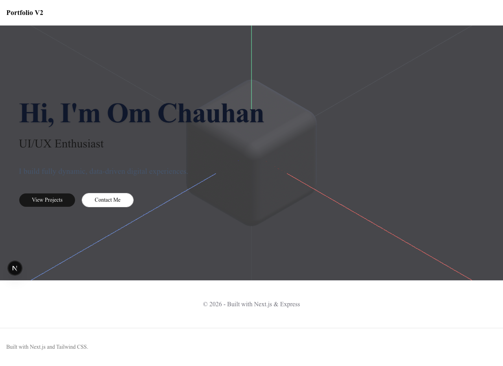

# Om Chauhan - Resume & Portfolio

Welcome to the source code for my interactive resume and portfolio website. This project showcases my skills, experience, and projects in a dynamic and visually engaging web application.

## 📸 Snapshots

### Frontend View
Here is a snapshot of the running web application:



*(Note: The root Vite application can also be viewed via `docs/root-vite-snapshot.png`)*

## 🚀 Features

- **Interactive UI**: Built with modern web technologies, providing a seamless user experience.
- **Dynamic Content**: Data is managed via a dedicated backend, allowing for easy updates to projects, skills, and experience without hardcoding.
- **Responsive Design**: Works great on both desktop and mobile devices.

## 🛠 Tech Stack

- **Frontend**: Next.js / React (with Vite setup available), Tailwind CSS, Spline (3D elements)
- **Backend**: Node.js, Express, MongoDB
- **Tools**: Playwright for snapshots, concurrently for development

## 💻 Running Locally

To run the full stack locally:

1. Clone the repository
2. Install dependencies for both backend and frontend:
   ```bash
   cd backend && npm install
   cd ../frontend && npm install
   ```
3. Start the application stack (both backend and frontend servers):
   ```bash
   ./start.sh
   ```
4. Access the frontend at `http://localhost:3000`

## 📁 Project Structure

- `frontend/` - Contains the Next.js React frontend application.
- `backend/` - Contains the Node.js API that serves dynamic data for the resume.
- `docs/` - Contains website snapshots and documentation assets.
